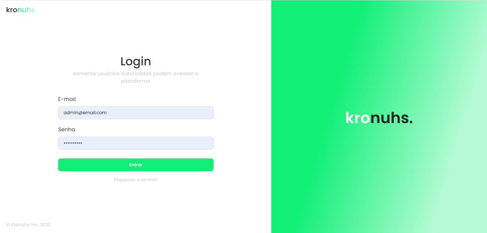

<div align="center">
  
  <h3>Painel de gestão para blogs</h3>
</div>

## 📃 Sobre

<br />

O Painel de gestão da **kronuhs** foi desenvolvido tendo como foco demonstrar a interação com um frontend web de um blog e uma api rest.

Esta aplicação permite que o usuário possa criar editar e excluir postagens, além de cadastrar novos usuários que podem ter os cargos de "admin" e "editor". usuários do tipo "editor" possuem restrições em relação a páginas e visualização de componentes que somente usuários do tipo "admin" podem interagir.

## 💻 Principais Tecnologias utilizadas no projeto

Este projeto utiliza diversas tecnologias bem legais e úteis que você talvez possa gostar e utilizar em alguns projetos.

- [React](https://pt-br.reactjs.org/)
- [Next.js](https://nextjs.org/docs)
- [Typescript](https://www.typescriptlang.org/)
- [Date-fns](https://date-fns.org/)
- [Nookies](https://www.npmjs.com/package/nookies)
- [Phosphor-icons](https://phosphoricons.com/)
- [React-hot-toast](https://react-hot-toast.com/)
- [React-hook-form](https://react-hook-form.com/get-started)
- [zod](https://github.com/colinhacks/zod)
- [React-modal](https://www.npmjs.com/package/react-modal)
- [Styled-components](https://styled-components.com/)

## Funcionalidades

Este projeto possui diversas funcionalidades úteis em um blog que você pode conferir logo abaixo:

- Criação de usuários.

- Edição de dados do usuário logado

- Exclusão de usuário

- Atualização de avatar via upload

- Sistema de autenticação

- Recuperação de senha via email

- Criação de postagens

- Páginação de postagens

- Edição de postagens

- Exclusão de postagens

## Como executar o projeto na sua máquina

<br />

Para executar o projeto você terá de seguir os passos listados abaixo. 

Primeiro clone o repositório do projeto com o comando:

<br />

```bash
git clone git@github.com:henrique998/kronuhs-dashbord.git
```

Execute um dos comando abaixo para instalar as dependências do projeto:

```bash
npm install
# OU
yarn install
```

<br />

Agora está tudo pronto para iniciar o projeto. execute o comando abaixo para iniciar o servidor:

<br />

```bash
npm run dev
# OU
yarn dev
```

## Aviso

<br />

**Primeiro**: Lembre-se de clonar a api abaixo, instalar as depências e iniciar o servidor. você pode conferir mais detalhes em: 

- [Kronuhs-api](https://github.com/henrique998/kronuhs-api)

**Segundo**: Este painel está atrelado a dois projetos no total, uma api (citada no passo anterior) e um frontend web, escrito também em [Next.js](https://nextjs.org/docs)

Você pode encontrar o frontend web em:

- [Kronuhs-web](https://github.com/henrique998/kronuhs-web)

## Contato

<br />

Entre em contato comigo por email ou no linkedin:

- henriquemonteiro037@gmail.com
- [linkedin](https://www.linkedin.com/in/henrique-monteiro1/)